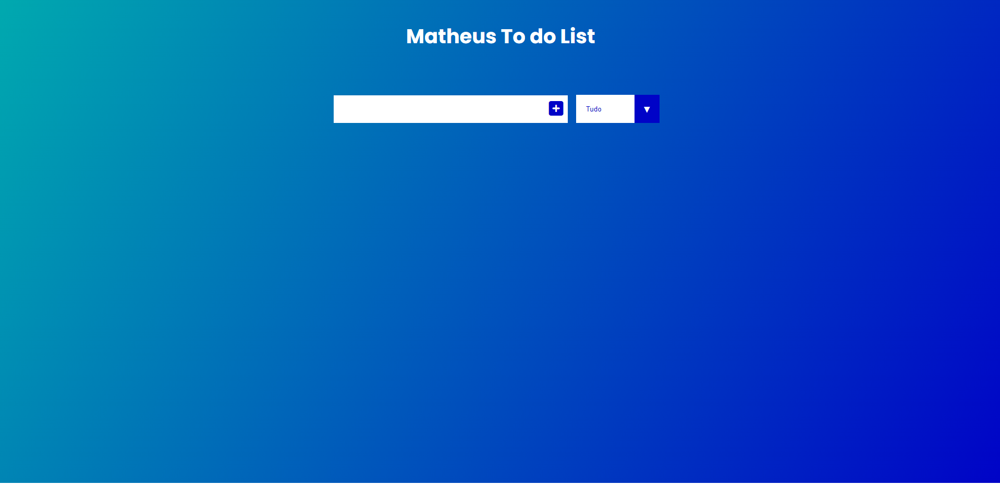

## 🖥️ Projeto
 O Projeto é uma página Web que propõe ao usuário adicionar suas tarefas diárias. Também é possível marcar a tarfa com realizada ou até mesmo excluí-la. Outra funcionalidade é o filtro para tarefas concluídas ou em andamento.

## 👨🏼‍💻 Tecnologias
Projeto desenvolvido utilizando as seguintes tecnologias HTML, CSS, JavaScript, Git e GitHub.

## 🏷️ Layout
Você pode visualizar o layout do projeto através [desse link](https://mathpisani.github.io/lista-de-livros).